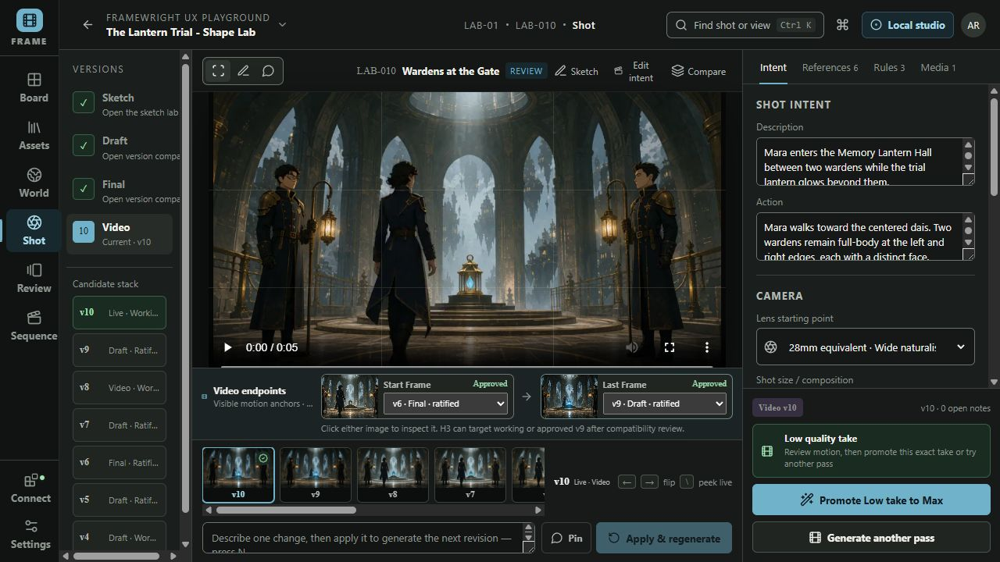
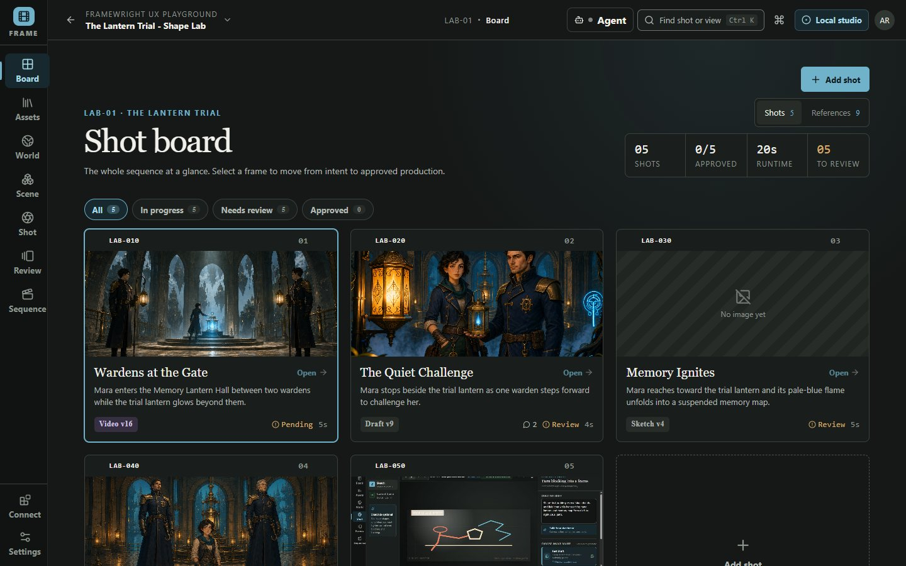
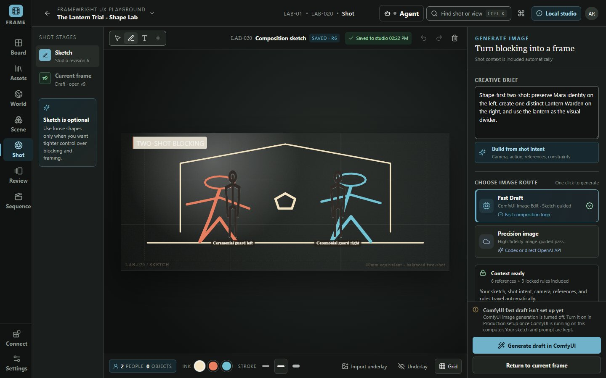
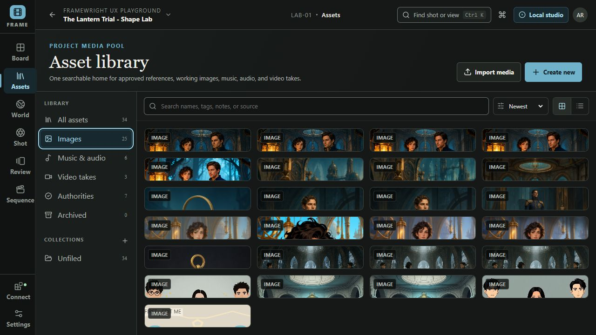
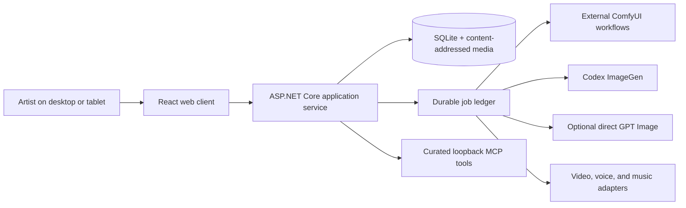

# Framewright

<p align="center">
  <strong>Local-first AI storyboarding and film pre-production, built around the shot.</strong>
</p>

<p align="center">
  Plan cinematic sequences, preserve visual continuity, direct reference-guided image generation, review immutable versions, and move chosen frames into first/last-frame video workflows—without making artists operate a node graph.
</p>

<p align="center">
  <a href="https://github.com/raydeStar/framewright/actions/workflows/ci.yml"></a>
  
  
  
  
  
</p>



<p align="center"><em>One shot workspace from composition and references through review, approval, and motion.</em></p>

<p align="center">
  <a href="#why-framewright">Why Framewright</a> ·
  <a href="#from-sketch-to-video">Workflow</a> ·
  <a href="#quick-start">Quick start</a> ·
  <a href="#architecture-and-trust-boundaries">Architecture</a> ·
  <a href="#documentation">Documentation</a>
</p>

## Why Framewright

Framewright is a local-first AI storyboard and film pre-production studio for directors, visual storytellers, and small production teams. It combines shot planning, character and wardrobe consistency, world/style rules, semantic visual references, image iteration, storyboard asset management, and generative video preparation in one production workspace.

It is not another prompt box and it is not a ComfyUI graph editor. The artist defines the shot; Framewright freezes the exact intent, camera language, approved references, spatial notes, and locked rules into a reviewable generation packet. ComfyUI, Codex ImageGen, direct GPT Image, video, voice, and YuE2 music remain explicit adapters behind that contract.

> **Current scope:** Framewright is pre-release software for a trusted local Windows workstation, working towards its first release ([MVP goal](docs/goals/mvp-release.md)). Its application, packaging, recovery and browser contracts are tested automatically. The mandatory live-provider and human acceptance checks for `v0.1.0` are not yet recorded; see [release evidence](docs/RELEASE_EVIDENCE.md) for the ledger.

The `v0.1.0` release ships as a portable Windows zip (below); Docker remains the managed runtime for a source checkout. The release covers shots and review, ComfyUI and Codex image work through H3 video, the 3D path (a generated prop, a rigged humanoid, a scene, and an animated take), two local voices, assembly, recovery, and production export. The direct-key OpenAI lane, YuE2 composition/rendering, and paired-tablet review remain clearly marked preview capabilities.

## From sketch to video

1. **Plan the shot** — Describe what happens in a sentence; add camera, action and timing when you want them, choose a lens starting point, and lock the project delivery format.
2. **Block the composition** — Draw loose shapes or stage poseable people, props, doorways, movement arrows, and reusable joint poses in the tablet-friendly sketch lab.
3. **Attach visual canon** — Assign approved character identity, wardrobe, location, prop, and style references. World laws stay separate from shot-specific framing.
4. **Generate and iterate** — Run a fast ComfyUI draft or a precision image route, place feedback directly on the frame, compare immutable versions, and approve only what passes review.
5. **Animate and assemble** — Choose a shot revision as the start frame, optionally derive a compatible last frame, render review-quality motion, and promote the reviewed take's seed and endpoints into a Max render while picture and sound remain independently editable.

<table>
  <tr>
    <td width="50%">
      
      <br><strong>See the sequence.</strong> Shots expose stage, runtime, review state, and the next decision at a glance.
    </td>
    <td width="50%">
      
      <br><strong>Direct the frame.</strong> A sketch is optional; shot intent, camera, references, and constraints travel automatically.
    </td>
  </tr>
  <tr>
    <td colspan="2">
      
      <br><strong>Reuse the work.</strong> Images, approved authorities, audio, music, and video takes live in one searchable project media pool.
    </td>
  </tr>
</table>

## Built for visual continuity

| Production concern          | What Framewright preserves                                                                                                        |
| --------------------------- | --------------------------------------------------------------------------------------------------------------------------------- |
| **Shot intention**          | Description, action, camera direction, framing, lens guidance, and project delivery settings                                      |
| **Character consistency**   | Immutable identity authorities, separate wardrobe references, defining traits, and exact-image pins                               |
| **World and art direction** | Project-wide visual language, canon, always-preserve rules, and anti-drift constraints                                            |
| **Visual consistency gate** | Codex compares the exact current image to the versioned shot contract; visible conflicts can fix the image, update only the shot, or remain explicitly unresolved |
| **Composition**             | Optional underlays, pressure-aware sketching, poseable blocking, semantic placements, and spatial feedback                        |
| **Revision history**        | Version-bound notes and markup, candidate comparison, ratification gates, and frozen manifests                                    |
| **Motion continuity**       | Project-locked resolution, selected shot revisions as endpoints, optional last frames, take lineage, and encoded-video validation |
| **Sound editorial**         | Separate Dialogue, Voice, and Music lanes, plus an independent WAV mix export instead of baked-in sound                           |
| **Operational recovery**    | Durable provider jobs, exact prompt ownership, restart recovery, verified backups, and atomic local installation                  |

## Image generation without reference roulette

Framewright treats references as production roles, not a pile of unnamed images.

- A **composition frame** controls crop and blocking.
- **Pinned references** receive an explicit subject, region, or purpose.
- A bounded ComfyUI image slot is reserved for **global style** when the selected workflow supports it.
- Character identity, wardrobe, locations, and props remain separately labeled.
- Overflow authorities stay in locked textual canon rather than pretending every workflow has unlimited image conditioning.
- Every provider packet records what was selected, what was actually attached, and which constraints survived dispatch.

ComfyUI integration is deliberately model-agnostic at the product boundary. Framewright validates allowlisted API-format workflows and their declared capabilities; the artist-facing flow does not assume a particular checkpoint or expose a node graph.

## Generation routes

| Route                | Best for                                                                | Connection                                                           |
| -------------------- | ----------------------------------------------------------------------- | -------------------------------------------------------------------- |
| **Fast Draft**       | Composition loops and reference-guided working frames                   | Existing local ComfyUI service with a validated Framewright workflow |
| **Codex ImageGen**   | High-fidelity generation or edits using the current shot packet         | Official Codex CLI and the workstation's ChatGPT/Codex login         |
| **Direct GPT Image** | Optional direct OpenAI image generation and editing                     | Separate OpenAI Platform project API key                             |
| **Video**            | Text/image-to-video with a selected start frame and optional last frame | Allowlisted external ComfyUI video workflow                          |
| **Local voice**      | Character auditions and approved voice profiles                         | Optional authenticated native Windows worker                         |
| **Music**            | Generated score candidates kept separate from picture                   | Optional allowlisted external workflow                               |

Provider credentials never persist in browser storage. Codex authentication and OpenAI API authentication are intentionally separate: a ChatGPT/Codex login is not an API bearer token, while the optional direct OpenAI lane requires its own project key.

## Quick start

### Download and run

1. Download `framewright-<version>-win-x64.zip` from the [releases page](https://github.com/raydeStar/framewright/releases) and extract it anywhere.
2. Double-click **Framewright Studio.exe** in the extracted `Framewright` folder. The studio opens in your browser at [http://127.0.0.1:5179](http://127.0.0.1:5179), reachable only from this computer. This pre-release build is not code-signed, so Windows may ask you to confirm the first time ("More info", then "Run anyway").
3. Explore the sample project, or create your own from the project menu. To generate images or video, open **Production setup → Image and video generation** and connect ComfyUI or Codex; nothing is sent anywhere until you turn it on there.

Double-click **Stop Framewright.cmd** to stop the studio. Your work lives in the `App_Data` folder beside it; to update, stop the studio and extract a newer zip over the same folder. `READ ME FIRST.txt` in the zip says the same. Video export uses FFmpeg and FFprobe on your `PATH`; 3D generation and rigging use a separately installed [Reference Asset Compiler](docs/REFERENCE_ASSET_COMPILER.md); local voice and music need their own workers (below).

From a source checkout, `.\scripts\install-local.ps1 -PublishPath <extracted folder>` installs the same package under `%LOCALAPPDATA%\Framewright` with Start Menu shortcuts (Framewright, Stop Framewright, and Framewright with local voice) and atomic updates that keep your work.

### Guided setup with Codex

Open the cloned repository as a local Codex task and send:

> Use `$framewright-setup` to configure Framewright on this workstation. Inspect
> what is already installed before asking me questions. Explain every file,
> download, login, and provider capability before changing it. Do not start a
> generation job. When setup is ready, launch Framewright and open its Setup
> drawer for me.

Codex will ask which runtime and generation lanes you want, inspect ComfyUI and
its installed models read-only when requested, write only ignored workstation
configuration, and leave unselected providers disabled. It never needs an API
key pasted into chat. See [the transparent setup contract](docs/CODEX_SETUP.md).

### Manual setup

#### Prerequisites

- Windows 10 or 11 with PowerShell
- Docker Desktop recommended, or .NET SDK `10.0.203` and Node.js `24` for native development
- FFmpeg and FFprobe only when validating production video through the native runtime; both are included in Docker
- ComfyUI, Codex, direct OpenAI, video, voice, and music providers are optional until their corresponding generation action is used

Music is no longer a prompt-to-audio ComfyUI lane. Framewright stores an editable
composition and immutable ABC-backed revisions, then asks a separate local YuE2
service to render a chosen revision. See [YuE2 music setup and architecture](docs/YUE2_MUSIC.md).

#### Launch

```powershell
git clone https://github.com/raydeStar/framewright.git
cd framewright
.\scripts\start.ps1
```

The launcher opens [http://127.0.0.1:5179](http://127.0.0.1:5179). It prefers the managed Docker runtime and falls back to the native Windows path when Docker Desktop is unavailable. Codex ImageGen, local voice, and all ComfyUI submission lanes start off. Turn on ComfyUI images, ComfyUI video, or one-click Codex images in **Production setup → Image and video generation**, which also tests the ComfyUI address; `scripts/setup.ps1` remains available for voice, music, and scripted setup.

```powershell
.\scripts\start.ps1 -Rebuild  # rebuild after container or application changes
.\scripts\start.ps1 -Native   # deliberately use the native development path
```

Both launch modes use the same ignored project data root and leave the external ComfyUI queue alone.

<details>
<summary><strong>Docker operations</strong></summary>

```powershell
.\scripts\docker.ps1 rebuild
.\scripts\docker.ps1 start
.\scripts\docker.ps1 status
.\scripts\docker.ps1 logs
.\scripts\docker.ps1 stop
```

The container packages Framewright, SQLite, FFmpeg, FFprobe, and the pinned Codex CLI. It binds only to `127.0.0.1:5179`, reaches an existing ComfyUI service through `host.docker.internal`, and never packages model weights or arbitrary external workflows.

To enable the optional direct OpenAI lane, place `OPENAI_API_KEY=...` in the ignored `.env`. The value is injected only into the service environment.

</details>

<details>
<summary><strong>Local voice setup</strong></summary>

```powershell
.\scripts\setup-voice-worker.ps1
.\scripts\docker.ps1 start
```

Voice inference remains native on Windows so it can use the local GPU runtime. Model weights, worker credentials, process state, and logs stay outside the repository and replaceable application package. If the optional worker is absent, Framewright starts in a visible degraded mode while board, image, review, and export work remain available.

</details>

## Architecture and trust boundaries



- The React client is an untrusted presentation layer; ASP.NET Core owns validation, approvals, persistence, credentials, and job state.
- Generation is explicit. Framewright never clears, interrupts, reorders, cancels, or harvests another ComfyUI prompt.
- The returned provider request ID is persisted before polling, so restart recovery resumes the exact job rather than silently posting a duplicate.
- Workflow selection is allowlisted server-side. The browser cannot submit arbitrary node graphs or filesystem paths.
- OpenAI API keys use a Windows CurrentUser DPAPI envelope or service-environment injection and are excluded from browser state, SQLite, logs, child Codex processes, backups, and exports.
- The loopback MCP server exposes curated read tools and one approval-requiring candidate import—not raw database, provider, queue, or filesystem control.

See [Framewright architecture and trust boundaries](docs/ARCHITECTURE.md) for the full system contract.

## Project and repository boundaries

Framewright currently targets one trusted artist workstation; it is not a hosted multi-tenant service.

This repository contains application code, tests, documentation, and small validated workflow templates. It does **not** contain ComfyUI source, custom nodes, checkpoints, model weights, generated production media, private production assets, OpenAI credentials, or Codex credentials. The screenshots above use a fictional UX-playground project.

Project delivery is explicit and consistent: dimensions, aspect ratio, frame rate, color space, and audio sample rate belong to the project contract. Curated cinema and streaming presets fill those values without preventing deliberate custom settings.

## Verification

```powershell
.\scripts\verify.ps1
```

The release gate covers .NET build and integration contracts, TypeScript, linting, formatting, production bundle output, dependency audit, desktop Chromium and iPad-sized WebKit journeys, accessibility checks, backup/restore, launcher fallback, Docker environment projection, voice-worker ownership, container health, writable storage, and restart persistence.

Browser tests use an isolated temporary database on port `5180`. They never reuse the artist-facing database or contact the configured ComfyUI service.

For packaging and rollback proofs:

```powershell
.\scripts\publish-local.ps1
.\scripts\smoke-package.ps1
.\scripts\smoke-installer.ps1
.\scripts\smoke-launcher.ps1
.\scripts\package-zip.ps1     # the portable zip, smoke-tested from its extracted copy
.\scripts\smoke-docker-persistence.ps1
```

Automated contracts do not masquerade as live-provider evidence. Before tagging a workstation release, record the actual GPU, workflow revisions, model locks, provider jobs, and output artifacts in [the release evidence matrix](docs/RELEASE_EVIDENCE.md).

Prepare an exact, backed-up, provenance-stamped candidate from a clean and pushed `main`:

```powershell
.\scripts\prepare-release-candidate.ps1
```

The command refuses active Framewright jobs, verifies the backup and release gates, rebuilds only Framewright, proves the served commit matches the image label and `HEAD`, and writes redacted QA evidence under `artifacts/release/`. It never submits or interrupts ComfyUI work. Complete [the manual QA runbook](docs/QA_RUNBOOK.md) before tagging the candidate.

## Tablet access

Framewright is responsive and pen-friendly. For encrypted access on a trusted local network:

```powershell
.\scripts\create-tablet-certificate.ps1
.\scripts\start-tablet.ps1 -CertificatePath "$env:LOCALAPPDATA\Framewright\certificates\framewright-tablet.pfx"
```

The certificate includes hostname, localhost, and current IPv4 subject-alternative names. The explicit HTTP LAN escape hatch is not equivalent to encrypted transport.

## Documentation

| Guide                                                    | Use it for                                                                       |
| -------------------------------------------------------- | -------------------------------------------------------------------------------- |
| [Implementation handoff](docs/IMPLEMENTATION_HANDOFF.md) | Current product decisions, boundaries, provider strategy, and known risks        |
| [Architecture](docs/ARCHITECTURE.md)                     | Domain ownership, persistence, adapters, security, and trust boundaries          |
| [Asset Library](docs/ASSET_LIBRARY.md)                   | Media-pool model, collections, references, generation routes, and shot placement |
| [Workflow templates](workflows/README.md)                | Allowlisted ComfyUI contracts and endpoint roles                                 |
| [Release evidence](docs/RELEASE_EVIDENCE.md)             | Automated guarantees versus live-provider acceptance evidence                    |
| [Manual QA runbook](docs/QA_RUNBOOK.md)                  | Exact front-to-back acceptance steps for promoting a candidate                    |
| [Contributing](CONTRIBUTING.md)                          | Development rules, tests, and provider safety                                    |
| [Security](SECURITY.md)                                  | Supported boundary and vulnerability reporting                                   |

## License

Framewright is licensed under the [Apache License 2.0](LICENSE).

## Frequently asked questions

### Does Framewright replace ComfyUI?

No. Framewright owns the artist-facing shot, reference, review, and approval workflow. ComfyUI remains an external generation service behind validated, allowlisted adapters.

### Can Framewright preserve character consistency across shots?

It preserves exact identity, wardrobe, world, style, and prop authorities in frozen manifests and labels what each reference controls. Output quality still depends on the selected provider and workflow; Framewright makes the conditioning explicit and auditable rather than promising magic.

### Does it support first and last frame video generation?

Yes. A shot can use a selected image revision as its start frame and an optional compatible last frame. Resolution and delivery settings remain project-locked, and promotion preserves the reviewed take's creative seed, endpoints, and lineage in a new Max render.

### Can Codex work with Framewright without direct code or database access?

Yes. The loopback MCP surface exposes curated production context and an approval-marked candidate import. Codex cannot ratify canon, clear queues, or browse arbitrary files through Framewright.

### Is Framewright cloud hosted?

No. It is a local-first workstation application. Optional generation providers may be local or remote, but project state, approvals, credentials, and the durable job ledger remain under the artist's control.

---

<p align="center">
  <strong>Build every shot with intention.</strong><br>
  Framewright is under active development by Mark Hall and released under Apache-2.0.
</p>
