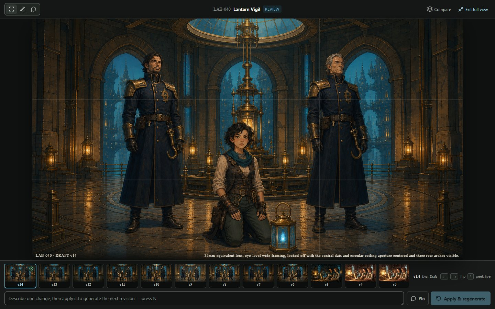
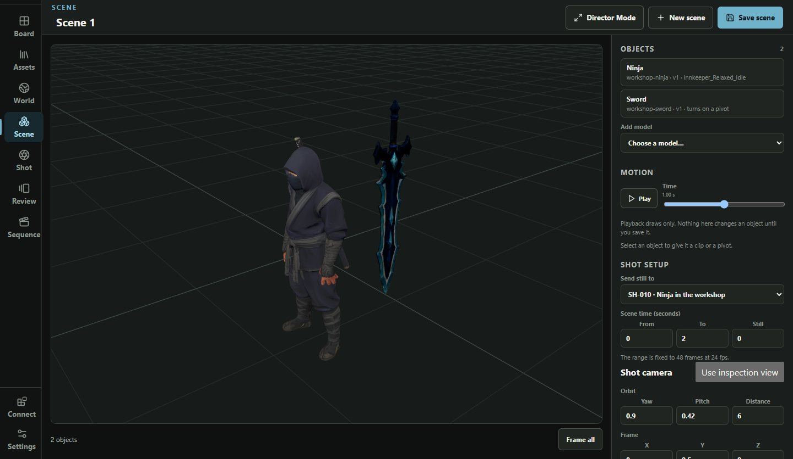
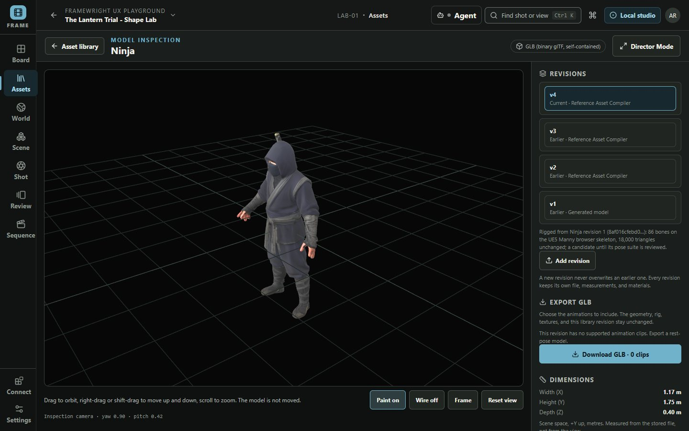
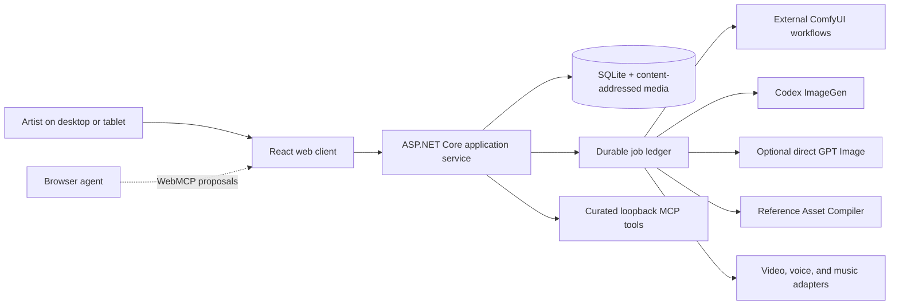

<h1 align="center">Framewright</h1>

<p align="center">
  <strong>A local-first AI storyboard, previs, and film pre-production studio, built around the shot.</strong>
</p>

<p align="center">
  Plan a sequence shot by shot, keep characters and worlds consistent, direct reference-guided image generation, block out 3D scenes with generated and rigged models, and turn approved frames into animated takes, all on your own Windows workstation, without operating a node graph.
</p>

<p align="center">
  <a href="https://github.com/raydeStar/framewright/releases/latest"></a>
  
  
  
  
  <a href="LICENSE"></a>
</p>

<p align="center">
  <a href="https://github.com/raydeStar/framewright/releases/latest"><strong>Download for Windows</strong></a> ·
  <a href="#quick-start">Quick start</a> ·
  <a href="#features">Features</a> ·
  <a href="#3d-scenes-and-previs">3D previs</a> ·
  <a href="#architecture-and-trust-boundaries">Architecture</a> ·
  <a href="#frequently-asked-questions">FAQ</a>
</p>


<p align="center"><em>One shot workspace from intent and references through review, approval, and motion.</em></p>

## What is Framewright?

Framewright is storyboarding and pre-production software for directors, visual storytellers, and small production teams. It keeps the whole path from idea to animatic in one workspace: a shot list and shot board, character, wardrobe, and world references, AI image generation with feedback pinned to the frame, immutable versions with explicit approval, 3D scene blocking with generated props and rigged characters, animated takes, and a sound editorial timeline.

It is not another prompt box, and it is not a ComfyUI graph editor. You describe the shot; Framewright freezes the exact intent, camera language, approved references, spatial notes, and locked rules into a reviewable generation packet. ComfyUI, Codex ImageGen, direct GPT Image, video, voice, music, and the 3D compiler are explicit adapters behind that contract, each switched off until you turn it on.

Everything runs on your machine. Projects, media, approvals, and credentials stay local, and every core creative action works from ordinary controls. An AI agent can help, but never has to.

> **Release status:** `v0.1.0` is the first release, for a trusted local Windows workstation. Its application, packaging, recovery, and browser contracts are tested automatically, and the full 3D scenario was run end to end on the packaged build. Live ComfyUI, H3 video, and local voice runs are not yet recorded for this release, and its human verdicts were delegated; the [release evidence](docs/RELEASE_EVIDENCE.md) ledger has the details. The direct OpenAI key lane, YuE2 music, and paired-tablet review are marked as previews.

## Features

| Feature | What it gives you |
| --- | --- |
| **Shot-first storyboarding** | Start a shot from one sentence and a length in seconds. Camera, action, lens, and references are there when you want them. The shot board shows stage, runtime, review state, and the next decision for the whole sequence. |
| **Visual continuity** | Character identity, wardrobe, location, prop, and style references are immutable and labelled by what they control. World rules stay separate from shot framing, and every generation records which references were actually attached. |
| **Review and approval** | Every generation is an immutable version. Pin feedback to a spot on the frame, compare versions, and approve only what passes. A new version never silently replaces approved work, and an open note blocks approval until it is resolved. |
| **Director Mode** | Point at a frame or a scene object and describe what should change. A browser agent reads exactly what you are looking at and stages a proposal; you review it and apply it. Proposing never generates, saves, or approves anything. |
| **3D scenes and previs** | Generate a static prop from a reference image, rig a humanoid, block out a scene from a reference, replace stand-ins with library models, and animate with clips and pivot motion. |
| **Animated takes** | Render a scene still into ordinary shot review. Once it is approved, render an exact-frame animated take, or send approved frames to a first/last-frame video workflow. |
| **Sound editorial** | Separate Dialogue, Voice, and Music lanes with sequence assembly and an independent WAV mix export, so picture and sound stay separately editable. |
| **Local-first and recoverable** | SQLite plus content-addressed media, durable provider jobs that survive a restart, editable project export and import, and verified backups with an offline restore tool. |

## From sketch to animated take

1. **Plan the shot.** Describe what happens; add camera, action, and timing when you want them, and lock the project delivery format.
2. **Block the composition.** Draw loose shapes, or stage poseable people, props, doorways, and movement arrows in the tablet-friendly sketch lab. A sketch is optional.
3. **Attach visual canon.** Assign approved character, wardrobe, location, prop, and style references.
4. **Generate and iterate.** Run a fast ComfyUI draft or a precision image pass, pin feedback directly on the frame, compare versions, and approve what passes review.
5. **Stage it in 3D.** Build the scene from generated props and rigged characters, frame a shot camera, and render a still into the same review path.
6. **Animate and assemble.** Render the approved scene as an exact-frame take, or use approved images as first and last frames for video, then assemble picture and sound on the sequence timeline.

<table>
  <tr>
    <td width="50%">
      
      <br><strong>See the sequence.</strong> Every shot's stage, runtime, review state, and next decision at a glance.
    </td>
    <td width="50%">
      
      <br><strong>Direct the frame.</strong> Block a composition, and shot intent, camera, references, and rules travel with it automatically.
    </td>
  </tr>
  <tr>
    <td width="50%">
      
      <br><strong>Point at what matters.</strong> Director Mode gives the frame the whole screen, with its versions and feedback in reach.
    </td>
    <td width="50%">
      
      <br><strong>Reuse the work.</strong> Images, 3D models, references, audio, music, and video takes in one searchable media pool.
    </td>
  </tr>
  <tr>
    <td width="50%">
      
      <br><strong>Block it in 3D.</strong> A rigged character plays a clip while a prop swings on its pivot; the shot camera is set beside it.
    </td>
    <td width="50%">
      
      <br><strong>Inspect every revision.</strong> A generated character, rigged as a new revision that names exactly where it came from.
    </td>
  </tr>
</table>

## Built for visual continuity

| Production concern          | What Framewright preserves                                                                                                                                         |
| --------------------------- | ------------------------------------------------------------------------------------------------------------------------------------------------------------------ |
| **Shot intention**          | Description, action, camera direction, framing, lens guidance, and project delivery settings                                                                       |
| **Character consistency**   | Immutable identity references, separate wardrobe references, defining traits, and exact-image pins                                                                 |
| **World and art direction** | Project-wide visual language, canon, always-preserve rules, and anti-drift constraints                                                                             |
| **Visual consistency gate** | Codex compares the exact current image to the versioned shot contract; a visible conflict can fix the image, update only the shot, or stay explicitly unresolved |
| **Composition**             | Optional underlays, pressure-aware sketching, poseable blocking, semantic placements, and spatial feedback                                                        |
| **Revision history**        | Version-bound notes and markup, version comparison, approval gates, and frozen generation manifests                                                               |
| **3D scenes**               | Scene instances pinned to exact model revisions, stand-in replacement that keeps identity and placement, notes anchored on an object, and frozen scene snapshots   |
| **Motion continuity**       | Project-locked resolution, approved versions as endpoints, optional last frames, take lineage, and encoded-video validation                                        |
| **Sound editorial**         | Separate Dialogue, Voice, and Music lanes, plus an independent WAV mix export instead of baked-in sound                                                           |
| **Operational recovery**    | Durable provider jobs, exact prompt ownership, restart recovery, verified backups, and atomic local installation                                                  |

## Image generation without reference roulette

Framewright treats references as production roles, not a pile of unnamed images.

- A **composition frame** controls crop and blocking.
- **Pinned references** receive an explicit subject, region, or purpose.
- A bounded ComfyUI image slot is reserved for **global style** when the selected workflow supports it.
- Character identity, wardrobe, locations, and props stay separately labelled.
- References beyond what a workflow can take as images stay in locked textual canon, rather than pretending every workflow has unlimited image conditioning.
- Every provider packet records what was selected, what was actually attached, and which constraints survived dispatch.

ComfyUI integration is deliberately model-agnostic at the product boundary. Framewright validates allowlisted API-format workflows and their declared capabilities; the artist-facing flow does not assume a particular checkpoint or expose a node graph.

## 3D scenes and previs

Framewright's 3D path turns reference images into a small, editable scene you can shoot:

- **Image to 3D prop.** Pick a reference, say roughly how big the object is, and generate. The model arrives in the library at real size and names the reference it came from.
- **Prepare for runtime.** Reduce triangles, drop faces nothing can see, compress textures, or resurface materials. Each result is a new, reviewable revision, never an overwrite.
- **Rig a humanoid.** Rig a standing figure on the UE5 Manny skeleton, review how it bends in a five-pose suite, and accept it as the current revision.
- **Block out a scene.** A browser agent can read a reference into a blockout plan of library models and stand-ins. You build it, correct placements and framing, and replace any stand-in with an exact library revision without moving anything else.
- **Animate.** Bind compatible clips to rigged characters with their own trim, speed, and loop, and give rigid parts pivot motion.
- **Shoot it.** Frame a shot camera, render a delivery-sized still into shot review, and once it is approved, render an exact-frame animated take encoded with FFmpeg.

Modelling, rigging, and texture work is done by the separate [Reference Asset Compiler](docs/REFERENCE_ASSET_COMPILER.md), which runs locally with Blender. Framewright owns the library, revisions, scenes, review, and shot binding.

## Generation routes

| Route                | Best for                                                                  | Connection                                                                   |
| -------------------- | ------------------------------------------------------------------------- | ---------------------------------------------------------------------------- |
| **Fast Draft**       | Composition loops and reference-guided working frames                     | Your existing local ComfyUI service with a validated Framewright workflow    |
| **Codex ImageGen**   | High-fidelity generation or edits using the current shot packet           | Official Codex CLI and the workstation's ChatGPT/Codex login                 |
| **Direct GPT Image** | Optional direct OpenAI image generation and editing (preview)             | A separate OpenAI Platform project API key                                   |
| **Video**            | Text- or image-to-video with an approved start frame and optional last frame | Allowlisted external ComfyUI video workflow (H3)                          |
| **3D models**        | Props from reference images, runtime preparation, and humanoid rigging    | Local [Reference Asset Compiler](docs/REFERENCE_ASSET_COMPILER.md) and Blender |
| **Local voice**      | Character voice auditions and approved voice profiles                     | Optional authenticated native Windows worker                                 |
| **Music**            | Editable compositions rendered to audio, kept separate from picture (preview) | Optional local [YuE2 service](docs/YUE2_MUSIC.md)                         |

Every route starts switched off. Provider credentials never persist in browser storage. Codex authentication and OpenAI API authentication are deliberately separate: a ChatGPT/Codex login is not an API bearer token, and the direct OpenAI lane needs its own project key.

## Quick start

### Download and run

1. Download `framewright-<version>-win-x64.zip` from the [latest release](https://github.com/raydeStar/framewright/releases/latest) and extract it anywhere.
2. Double-click **Framewright Studio.exe** in the extracted `Framewright` folder. The studio opens in your browser at [http://127.0.0.1:5179](http://127.0.0.1:5179), reachable only from this computer. This build is not code-signed, so Windows may ask you to confirm the first time ("More info", then "Run anyway").
3. Explore the sample project, or create your own from the project menu. To generate images or video, open **Production setup → Image and video generation** and connect ComfyUI or Codex. Nothing is sent anywhere until you turn it on there.

Double-click **Stop Framewright.cmd** to stop the studio. Your work lives in the `App_Data` folder beside it; to update, stop the studio and extract a newer zip over the same folder. `READ ME FIRST.txt` in the zip says the same.

Video export uses FFmpeg and FFprobe on your `PATH`. 3D generation and rigging use a separately installed [Reference Asset Compiler](docs/REFERENCE_ASSET_COMPILER.md). Local voice and music need their own workers (see below).

From a source checkout, `.\scripts\install-local.ps1 -PublishPath <extracted folder>` installs the same package under `%LOCALAPPDATA%\Framewright`. It adds Start Menu shortcuts (Framewright, Stop Framewright, and Framewright with local voice) and applies updates atomically, keeping your work.

### Run from source with Codex

Open the cloned repository as a local Codex task and send:

> Use `$framewright-setup` to configure Framewright on this workstation. Inspect
> what is already installed before asking me questions. Explain every file,
> download, login, and provider capability before changing it. Do not start a
> generation job. When setup is ready, launch Framewright and open its Setup
> drawer for me.

Codex asks which runtime and generation lanes you want, inspects ComfyUI and its installed models read-only when requested, writes only ignored workstation configuration, and leaves unselected providers disabled. It never needs an API key pasted into chat. See [the transparent setup contract](docs/CODEX_SETUP.md).

### Run from source by hand

#### Prerequisites

- Windows 10 or 11 with PowerShell
- Docker Desktop (recommended), or .NET SDK `10.0.203` and Node.js `24` for native development
- FFmpeg and FFprobe, only when validating production video through the native runtime; Docker includes both
- ComfyUI, Codex, direct OpenAI, the Reference Asset Compiler, voice, and music are optional until you use the action that needs them

#### Launch

```powershell
git clone https://github.com/raydeStar/framewright.git
cd framewright
.\scripts\start.ps1
```

The launcher opens [http://127.0.0.1:5179](http://127.0.0.1:5179). It prefers the managed Docker runtime and falls back to the native Windows path when Docker Desktop is unavailable. Codex ImageGen, local voice, and every ComfyUI submission lane start off. Turn on ComfyUI images, ComfyUI video, or one-click Codex images in **Production setup → Image and video generation**, which also tests the ComfyUI address. `scripts/setup.ps1` remains available for voice, music, and scripted setup.

```powershell
.\scripts\start.ps1 -Rebuild  # rebuild after container or application changes
.\scripts\start.ps1 -Native   # deliberately use the native development path
```

Both launch modes use the same ignored project data root and leave the external ComfyUI queue alone.

<details>
<summary><strong>Docker operations</strong></summary>

```powershell
.\scripts\docker.ps1 rebuild
.\scripts\docker.ps1 start
.\scripts\docker.ps1 status
.\scripts\docker.ps1 logs
.\scripts\docker.ps1 stop
```

The container packages Framewright, SQLite, FFmpeg, FFprobe, and the pinned Codex CLI. It binds only to `127.0.0.1:5179`, reaches an existing ComfyUI service through `host.docker.internal`, and never packages model weights or arbitrary external workflows.

To enable the optional direct OpenAI lane, place `OPENAI_API_KEY=...` in the ignored `.env`. The value is injected only into the service environment.

</details>

<details>
<summary><strong>Local voice setup</strong></summary>

```powershell
.\scripts\setup-voice-worker.ps1
.\scripts\docker.ps1 start
```

Voice inference stays native on Windows so it can use the local GPU. Setup downloads the pinned model weights (about 9 GB) into `%LOCALAPPDATA%\FramewrightVoice`; weights, worker credentials, process state, and logs stay outside the repository and the replaceable application package. If the optional worker is absent, Framewright starts in a visibly degraded mode while board, image, review, and export work remain available.

</details>

<details>
<summary><strong>Music setup</strong></summary>

Framewright stores an editable composition and immutable ABC-backed revisions, then asks a separate local YuE2 service to render a chosen revision. See [YuE2 music setup and architecture](docs/YUE2_MUSIC.md).

</details>

## Architecture and trust boundaries



- The React client is an untrusted presentation layer. ASP.NET Core owns validation, approvals, persistence, credentials, and job state.
- Generation is explicit. Framewright never clears, interrupts, reorders, cancels, or harvests another ComfyUI prompt.
- The provider's request ID is persisted before polling, so restart recovery resumes the exact job rather than silently posting a duplicate.
- Workflow selection is allowlisted server-side. The browser cannot submit arbitrary node graphs or filesystem paths.
- OpenAI API keys use a Windows CurrentUser DPAPI envelope or service-environment injection. They are excluded from browser state, SQLite, logs, child Codex processes, backups, and exports.
- Director Mode's browser (WebMCP) tools read the exact context on screen and stage proposals. Applying a proposal is always the artist's action, and no tool approves canon or starts a provider job.
- The loopback MCP server exposes curated read-only tools and one approval-marked candidate import, not raw database, provider, queue, or filesystem control.

See [Framewright architecture and trust boundaries](docs/ARCHITECTURE.md) for the full system contract.

## Project and repository boundaries

Framewright targets one trusted artist workstation; it is not a hosted multi-tenant service. The web service listens only on loopback unless you explicitly enable paired tablet access.

This repository contains application code, tests, documentation, and small validated workflow templates. It does **not** contain ComfyUI source, custom nodes, checkpoints, model weights, generated production media, private production assets, OpenAI credentials, or Codex credentials. The screenshots show a fictional playground project.

Project delivery is explicit and consistent: dimensions, aspect ratio, frame rate, color space, and audio sample rate belong to the project. Named formats (Widescreen HD or 4K, Cinema scope, Vertical) fill those values without preventing deliberate custom settings.

## Verification

```powershell
.\scripts\verify.ps1
```

The release gate covers:
- the .NET build and integration contracts
- TypeScript, linting, formatting, the production bundle, and the dependency audit
- desktop Chromium and iPad-sized WebKit journeys, including accessibility checks
- backup/restore and launcher fallback
- Docker environment projection, container health, writable storage, and restart persistence
- voice-worker ownership

Browser tests use an isolated temporary database on port `5180`. They never reuse the artist-facing database or contact the configured ComfyUI service.

For packaging and rollback proofs:

```powershell
.\scripts\publish-local.ps1
.\scripts\smoke-package.ps1
.\scripts\smoke-installer.ps1
.\scripts\smoke-launcher.ps1
.\scripts\package-zip.ps1     # the portable zip, smoke-tested from its extracted copy
.\scripts\smoke-docker-persistence.ps1
```

Automated contracts do not masquerade as live-provider evidence. Before tagging a workstation release, record the actual GPU, workflow revisions, model locks, provider jobs, and output artifacts in [the release evidence matrix](docs/RELEASE_EVIDENCE.md).

To prepare an exact, backed-up, provenance-stamped candidate from a clean and pushed `main`:

```powershell
.\scripts\prepare-release-candidate.ps1
```

The command does the following, and never submits or interrupts ComfyUI work:
- refuses to start while Framewright jobs are active
- verifies the backup and the release gate
- rebuilds only Framewright, and proves the served commit matches the image label and `HEAD`
- builds the portable zip
- writes redacted QA evidence under `artifacts/release/`

Complete [the manual QA runbook](docs/QA_RUNBOOK.md) before tagging the candidate.

## Tablet access

Framewright is responsive and pen-friendly. For encrypted access on a trusted local network:

```powershell
.\scripts\create-tablet-certificate.ps1
.\scripts\start-tablet.ps1 -CertificatePath "$env:LOCALAPPDATA\Framewright\certificates\framewright-tablet.pfx"
```

The certificate includes hostname, localhost, and current IPv4 subject-alternative names. The explicit HTTP LAN escape hatch is not equivalent to encrypted transport. Paired-tablet review is a preview in `v0.1.0`.

## Documentation

| Guide                                                          | Use it for                                                                        |
| -------------------------------------------------------------- | --------------------------------------------------------------------------------- |
| [Changelog](CHANGELOG.md)                                      | What each release contains, and its known limits                                   |
| [Implementation handoff](docs/IMPLEMENTATION_HANDOFF.md)       | Current product decisions, boundaries, provider strategy, and known risks         |
| [Architecture](docs/ARCHITECTURE.md)                           | Domain ownership, persistence, adapters, security, and trust boundaries           |
| [Asset library](docs/ASSET_LIBRARY.md)                         | Media-pool model, collections, references, generation routes, and shot placement  |
| [Reference Asset Compiler](docs/REFERENCE_ASSET_COMPILER.md)   | How 3D generation, preparation, and rigging are delegated and verified            |
| [3D conventions](docs/3D_CONVENTIONS.md)                       | Coordinate system, units, and the supported 3D route as it behaves today           |
| [Workflow templates](workflows/README.md)                      | Allowlisted ComfyUI contracts and endpoint roles                                   |
| [Release evidence](docs/RELEASE_EVIDENCE.md)                   | Automated guarantees versus live-provider acceptance evidence                      |
| [Manual QA runbook](docs/QA_RUNBOOK.md)                        | Exact front-to-back acceptance steps for promoting a candidate                     |
| [Contributing](CONTRIBUTING.md)                                | Development rules, tests, and provider safety                                      |
| [Security](SECURITY.md)                                        | Supported boundary and vulnerability reporting                                     |

## Frequently asked questions

### Is Framewright free?

Yes. Framewright is open source under the Apache License 2.0. Optional providers such as Codex or the OpenAI API have their own terms and costs, and nothing is sent to them until you turn them on.

### Does Framewright replace ComfyUI?

No. Framewright owns the artist-facing shot, reference, review, and approval workflow. ComfyUI remains an external generation service behind validated, allowlisted adapters, and Framewright never touches work it did not submit.

### Can it keep characters consistent across shots?

It preserves exact identity, wardrobe, world, style, and prop references in frozen manifests and labels what each reference controls. Output quality still depends on the provider and workflow you choose; Framewright makes the conditioning explicit and auditable rather than promising magic.

### Can it make 3D models and animation?

Yes. With the Reference Asset Compiler installed, Framewright generates static props from reference images, prepares them for real-time use, and rigs standing humanoids on the UE5 Manny skeleton. Scenes combine those models with clips, pivot motion, and a shot camera, and render to a still or an exact-frame animated take.

### Does it support first and last frame video generation?

Yes. A shot can use an approved image version as its start frame and an optional compatible last frame. Resolution and delivery settings stay project-locked, and promoting a reviewed take keeps its seed, endpoints, and lineage in a new Max render.

### Do I need a GPU?

Not for the studio itself: planning, review, sketching, scenes, and export run on an ordinary Windows PC, with 3D drawn in the browser. Local generation (ComfyUI, the 3D compiler, local voice) needs a capable GPU, and Codex ImageGen runs in the cloud through your Codex login.

### Can Codex or another agent work with Framewright?

Yes, through narrow tools rather than direct code or database access. In the browser, Director Mode's tools read what you are looking at and stage proposals for you to apply. On the server, the loopback MCP surface exposes curated production context and an approval-marked candidate import. No agent can approve canon, clear queues, or browse arbitrary files through Framewright, and everything an agent can help with also works by hand.

### Is Framewright cloud hosted? Does it run on macOS or Linux?

No. It is a local-first Windows workstation application; your project state, approvals, credentials, and job ledger stay on your machine. Optional generation providers may be local or remote. macOS and Linux are not supported targets in `v0.1.0`.

## License

Framewright is licensed under the [Apache License 2.0](LICENSE).

---

<p align="center">
  <strong>Build every shot with intention.</strong><br>
  Framewright is developed by Mark Hall and released under Apache-2.0.
</p>
