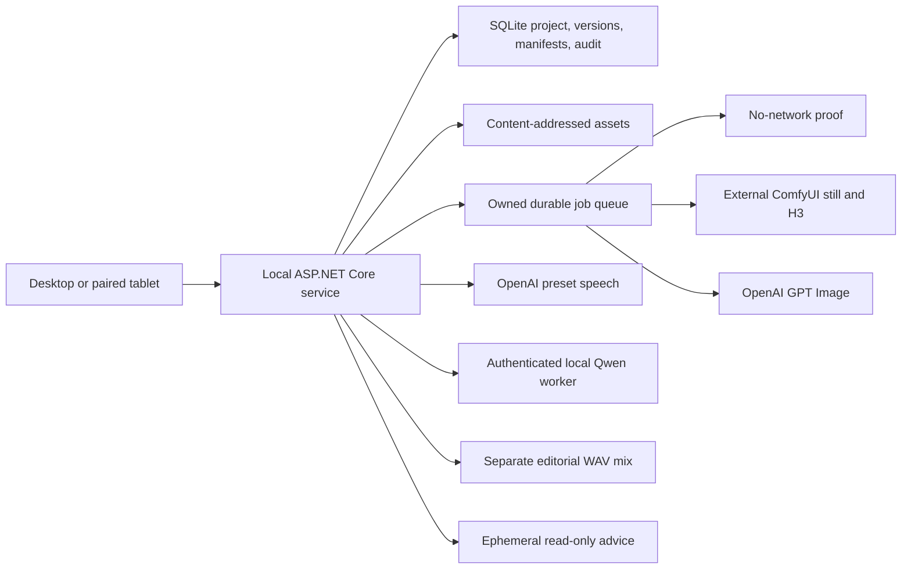

# Framewright architecture and trust boundaries

Framewright is a local-first modular monolith. React is an untrusted presentation client; ASP.NET Core owns domain validation, optimistic concurrency, approval transitions, persistence, provider credentials, job ownership, and audit. SQLite and the content-addressed asset root form one project workspace. `Studio:DataRoot` relocates that complete workspace together; an asset root diverges only through the explicit `Studio:AssetRoot` override.

Trust rules:

- Browser requests are domain commands, never arbitrary graphs or paths.
- Provider secrets stay server-side in a Windows user-bound encrypted store or service environment fallback.
- Credential-bearing OpenAI routes are HTTPS and official-host pinned by default; a custom proxy host requires a separate explicit opt-in.
- Codex and Platform credentials are separate. Child Codex processes do not inherit the Platform key.
- Ratified shot and authority versions are append-only. Reopening creates a new candidate.
- Library organization is metadata, not file movement: collections, tags, notes, archive state, and shot placements never rewrite the content-addressed source object.
- An asset placement supplies production context to a shot; it never replaces an immutable authority or ratifies an output.
- Manifests freeze exact version/hash inputs. Provider output becomes current only while the shot still matches that manifest.
- Preflight resolves an allowlisted workflow's declared capabilities against the frozen manifest. Composition, reference count, video endpoints, and provider readiness are rejected before queue mutation when the graph cannot honor them.
- Provider responses pass size/container validation and content-addressed import before review. Images are bounded at 25 MB and audio/video at 500 MB at both HTTP request and provider-response boundaries; large provider output is spooled to a delete-on-close file rather than held in memory.
- ComfyUI stays external. The local fast-draft adapter is enabled with a packaged, validated Framewright-owned API workflow; an artist click freezes context and submits one job. Other ComfyUI routes remain independently protected. Every route joins the existing queue and durably records only the prompt ID it submitted; restart recovery polls that exact history item and never posts a duplicate. It never clears, interrupts, reorders, cancels, or harvests another prompt.
- Video generation binds endpoint roles to exact ratified candidate revisions on one shot. The current ratified frame is the default start; an optional end must be another ratified revision of that shot. The frozen manifest records the resolved content hashes, while the Asset Library remains a media pool rather than the place where endpoint semantics are assigned.
- LAN APIs require pairing. Provider credential management is loopback-only. HTTPS with a tablet-trusted certificate is the production transport; HTTP requires an explicit private-network acknowledgement.
- Backups and production packages exclude credentials and external workflows. The application package contains only its reviewed, Framewright-owned workflow templates.
- Scheduled backups use SQLite online backup, content-addressed assets, archive verification, atomic promotion, and bounded retention. Restore remains an offline, operator-controlled operation with a pre-restore safety copy.
- Qwen runs in a separate Windows GPU worker with a random shared token, bounded request bodies, serialized GPU work, and only health/design/clone operations. The container cannot use this boundary to execute arbitrary host commands.
- The Linux application runs as the base image's unprivileged application user. Its only writable durable mount is the explicitly bound data root. Codex authentication and ImageGen skills enter through read-only seed mounts, then startup copies them into an ephemeral private Codex home so refresh and skill installation never mutate the host credential store.
- Docker is the outer execution sandbox for unattended Codex ImageGen: the process remains unprivileged and can see only the application image, project data, and read-only seed mounts. Native workstation launches retain Codex's `workspace-write` sandbox; Docker explicitly disables the nested Codex sandbox because the container kernel does not permit its user namespace.

Supported production progression:

`Sketch -> Draft candidate -> Ratified draft -> Final candidate -> Ratified final -> Video candidate -> Ratified video`

Audio never enters visual generation. Dialogue, voices, and music remain separate timeline assets; optional FFmpeg mastering produces a separate WAV.

The Asset Library adds two project-scoped relational layers above the content-addressed store: `AssetCollectionRecord` supplies optional manual bins, and `AssetPlacementRecord` attaches one canonical asset to a shot as an `Image guide`, `Video take`, or `Audio cue`. Smart views are queries over media type, archive state, and authority records rather than duplicated folders. Asset archive is non-destructive and reversible; a collection can only be removed after its assets are returned to Unfiled.

Image composition is shared by subject rather than duplicated by screen. A `Shot` subject enters the manifest/job/candidate pipeline; an `Asset` subject invokes the same curated image adapter boundary and imports its result directly into the library. Asset generation accepts shot frames as read-only reference assets but has no shot identifier, so the API cannot accidentally advance a shot version, approval gate, or candidate head. See [ASSET_LIBRARY.md](ASSET_LIBRARY.md) for the interaction and reference model.

See `docs/IMPLEMENTATION_HANDOFF.md` for the full shipped/commissioned boundary and operator checklist.
