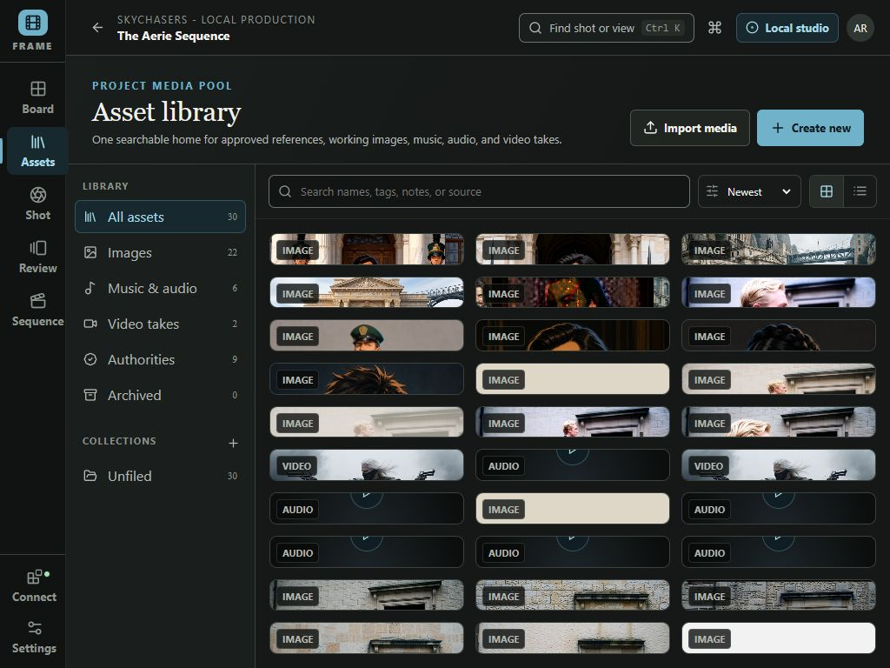
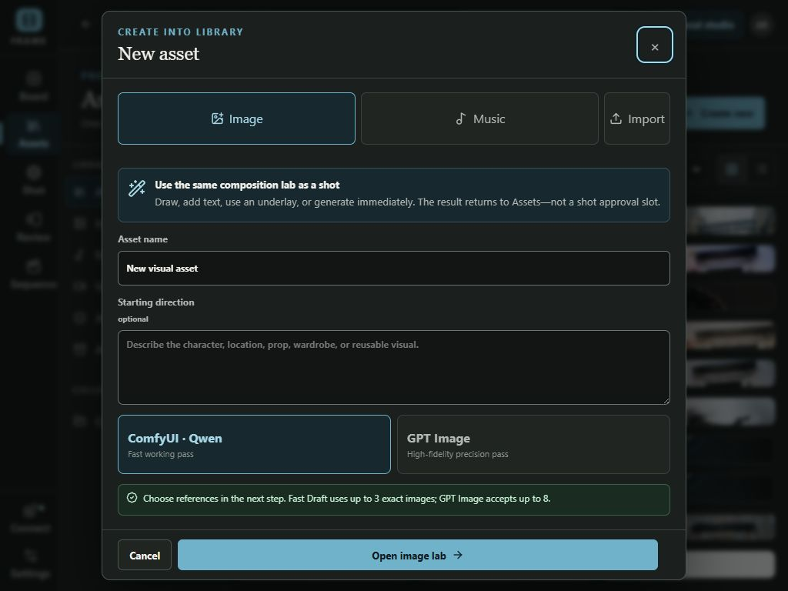
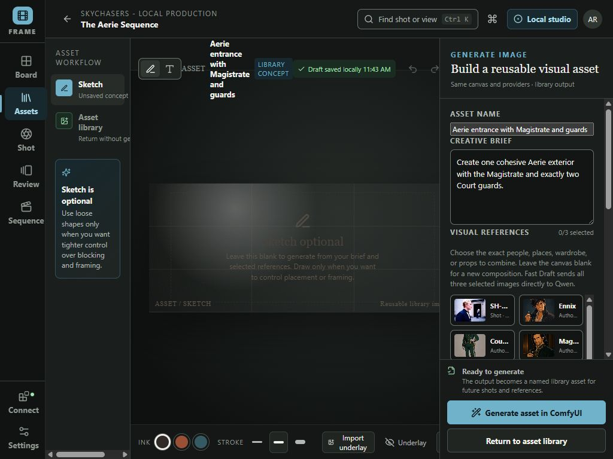
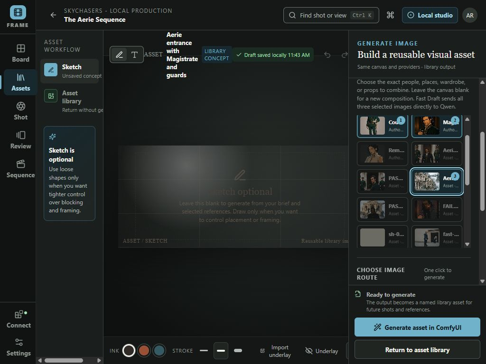
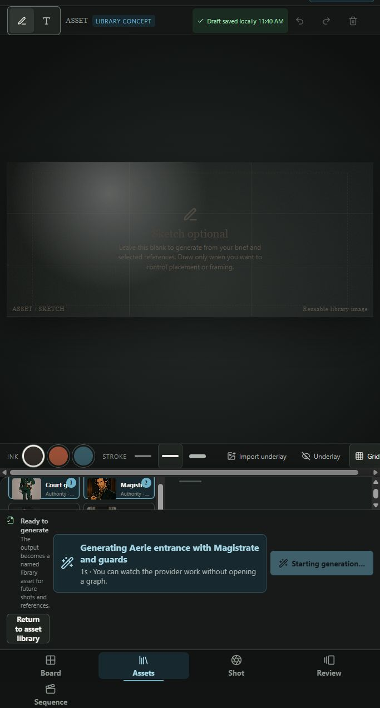
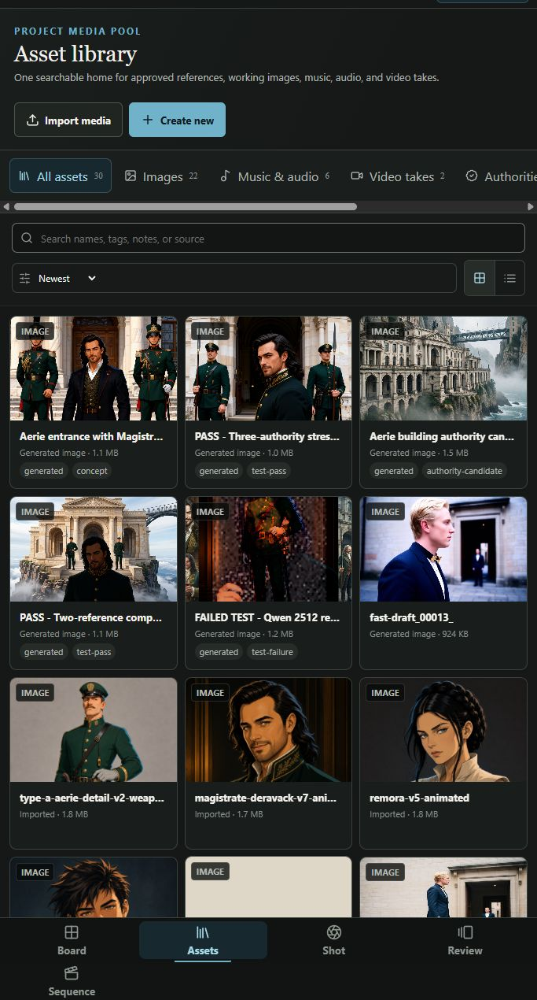
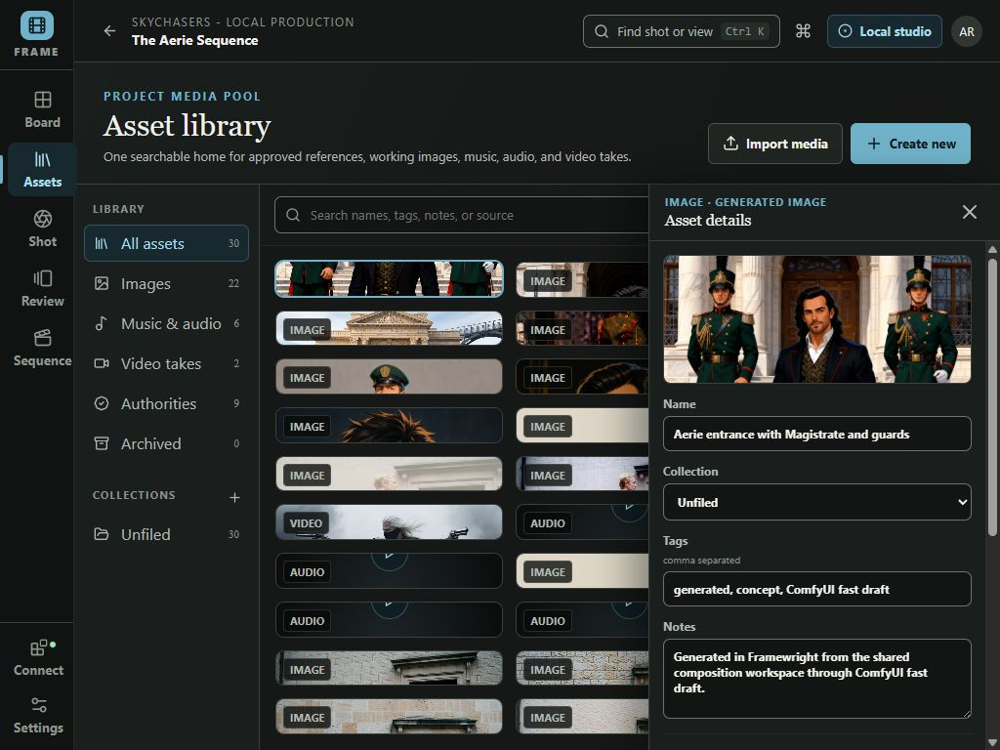

# Generate an image from multiple references

This workflow stays entirely inside Framewright. ComfyUI runs behind the scenes; the artist never opens or edits a node graph.

## 1. Open Assets

Choose **Assets** in the left workspace rail. This is the home for reusable images, authorities, music, audio, and video.

## 2. Create a new image asset

Choose **Create new**, leave **Image** selected, name the result, and write a plain-language starting direction. Choose **ComfyUI workflow** for the fast working route, then select **Open image lab**.

## 3. Decide whether to sketch

The canvas is optional. Leave it blank when the brief and references should establish a new composition. Draw simple blocking or import an underlay only when placement and framing need tighter control.

## 4. Select the exact references

Select up to three images for **Fast Draft**. The numbered badges are the order sent to the configured ComfyUI workflow:

1. Court guards
2. Magistrate
3. Aerie building

All three are sent as actual image inputs. A fourth reference is disabled until one is removed. Switch to GPT Image when as many as eight image references are needed.

Confirm the route card says **ComfyUI workflow · Reference compose**. Then choose **Generate asset in ComfyUI**.

## 5. Watch generation without opening ComfyUI

Framewright keeps the lab visible and shows the asset name plus elapsed time while ComfyUI works. The button is disabled while the request is active, preventing accidental duplicates.

## 6. Find the result

When generation finishes, Framewright returns to Assets and places the new result first in the **Newest** view.

## 7. Review and reuse it

Open the asset to inspect the full image, edit its name, tags, collection, and notes, create another variation, or attach it to a shot.

The generated test asset is named **Aerie entrance with Magistrate and guards**. It was created through this exact front-end flow using three direct visual references and a blank sketch canvas.
