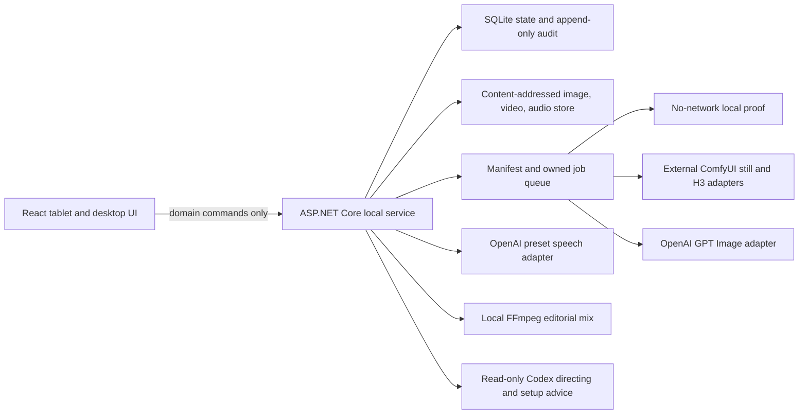

# Framewright implementation handoff

## Project-wide World settings

Framewright now has a dedicated **World** workspace for universal visual language, world canon, always-preserve rules, and negative/anti-drift rules. These values are project data rather than UI-only preferences. Saving them updates the optimistic-concurrency-protected project contract; every newly prepared still-image, asset-image, and H3 video manifest freezes a labeled `PROJECT WORLD SETTINGS` block before the shot-specific brief. Historical outputs and manifests remain unchanged.

The Skychasers default is intentionally described through visual traits—painterly cel shading, hand-painted textures, graphic shape language, designed animation characters, and cinematic lighting—rather than asking a provider to copy a named copyrighted work. The negative contract explicitly rejects photoreal live-action people and glossy game-engine rendering. The sketch interpreter is style-neutral: it removes literal guide marks while preserving deliberate cel shading and linework required by the World contract.

## Project-wide picture and voice authorities

The project contract owns one delivery width, height, aspect ratio, frame rate, color space, and audio sample rate. Curated Cinema scope, Streaming UHD, and Streaming HD presets are starting points, not hidden provider overrides. Still authorities may be larger, but video endpoints must match the project aspect within tolerance. Low and Medium H3 passes are disposable project-ratio proxies; High and promotion-only Max normalize the endpoints to one shared native canvas and encode on the exact project delivery canvas. A mismatched first or last frame is rejected before dispatch rather than stretched, cropped silently, or allowed to produce a differently shaped shot.

Voice identity follows the same authority pattern as picture identity. A reusable voice profile must cite one approved Character authority and one stored audio sample. The character card exposes that sample for playback; the provider voice ID remains the synthesis identity. Consented clones additionally require a durable consent attestation. Voice, dialogue, and music stay on separate editorial tracks and are never baked into H3 generation.

> Decision-ready product, UX, architecture, operations, and implementation record.
>
> Reconciled against the repository on 2026-08-18. This document distinguishes shipped behavior from external commissioning. Read it before changing trust boundaries or enabling a paid/production adapter.

## 1. Current product status

Framewright is a working local-first production application, not a node-graph UI and not a static prototype. It owns the artist-facing path from reference canon and shot intent—with an optional composition sketch—through candidate review, immutable approval, video handoff, and separate editorial audio.

The local product is production-capable. External render routes have explicit, independent commissioning boundaries:

- The no-network local proof adapter is ready and exercises the complete manifest/job/import/review path.
- The loopback ComfyUI still-image route is commissioned with packaged, validated text, sketch, reference-compose, and current-frame-edit workflows. **Add card → describe → Generate draft in ComfyUI** selects the appropriate workflow role from available context. It freezes exact shot context, submits one job, and returns to durable progress without showing a manifest gate. The immutable packet remains available through the API and audit record; it is not an artist-facing prerequisite.
- The selected graph is never invisible: the generation panel and sketch route show a configuration-driven, model-neutral workflow badge such as **ComfyUI Text Draft · Text to image** or **ComfyUI Image Edit · Sketch guided**. Operators can replace an allowlisted workflow without teaching the artist-facing UI a model name.
- YuE2 is the separate local editorial-audio renderer. Framewright owns immutable composition/ABC revisions and associates every output with its source revision; legacy MiniMax audio remains playable as ordinary audio assets. Music is never baked into video generation. H3 video uses a commissioned project-format workflow with optional first/last anchors and quality promotion.
- OpenAI GPT Image dispatch requires a server-side project API key and an explicit Generate click; there is no second feature gate. Preset speech remains independently disabled by default.
- No adapter may clear or interrupt an existing ComfyUI queue.
- No test makes a paid request or touches the active production render system.
- Every provider launch now has a deterministic server preflight. It names the exact allowlisted workflow, declared capabilities, reference capacity, endpoint support, and delivery contract; a blocked preflight cannot mutate a provider queue.
- Generation jobs persist attempts, heartbeats, provider prompt IDs, and retry lineage. A restart resumes an already-submitted ComfyUI prompt through `/history/{prompt_id}` rather than paying for or queuing it twice.

This is the correct production boundary: product state and contracts can be proven without silently commissioning external infrastructure.

## 2. Product promise and invariants

> The artist decides the shot. Framewright packages, validates, and routes the work without making the artist operate a node graph.

Non-negotiable rules:

- Ratify a still before generating video.
- Keep one named shot slot current; replace its candidate instead of creating uncontrolled variant sprawl.
- Ratified authority and shot versions are append-only evidence.
- Identity, wardrobe, props, architecture, style, and world facts travel as explicit constraints.
- World canon is not the same as the current crop. Off-camera does not mean deleted.
- A last frame is optional and must pass geometry/scale/dimension review. It is not a command to leap.
- Video prompts are visual-only. Dialogue, voices, sound effects, and music live on separate tracks.
- Voice clones require explicit consent metadata and an external provider adapter. The built-in OpenAI speech route supports preset voices only.
- Fast draft first; expensive final only after approval.
- Curated routes are the normal UX. Provider knobs remain protected configuration.

## 3. Repository and production boundary

This standalone Git repository contains application code, tests, scripts, and documentation only. It does not contain or vendor:

- ComfyUI source, custom-node source, models, checkpoints, LoRAs, or embeddings;
- active workflow JSON copied from the production installation;
- OpenAI or Codex credentials;
- Skychasers production media or active render assets;
- queue state belonging to another tool or operator.

ComfyUI is an external service. Its workflows are supplied by an explicit filesystem path at deployment time and stay out of this repository.

## 4. Shipped artist workflow

1. Edit the project contract: project/production name, sequence identity, FPS, and aspect ratio.
2. Create immutable authority records for characters, wardrobe, locations, architecture, props, and style. Opening a card enters a dedicated authority workspace: select any revision without leaving, edit library metadata, create a new immutable revision from text/import/shared image lab, copy an older revision forward as the new live top, or delete an uncited attempt. **Generate new revision** is a revise-this flow: the exact selected revision stays visibly active, its approved image is passed directly to the selected ComfyUI or GPT Image edit workflow, and an optional sketch can be drawn over it to direct composition changes. A text-only authority is labeled honestly and generates from its exact identity and locked constraint unless the artist adds a sketch. Version numbers are monotonically issued and never reused after deletion. Frozen manifests and retained placement records block destructive removal of exact authority evidence.
   Asset and authority revisions also support durable exact-image review pins. **Add note** targets the visible image rather than any letterbox margin; pins can be dragged, keyboard-nudged, reopened, and resolved. Notes stay with that exact image asset in both the authority view and standalone still-image studio. **Regenerate from N notes** carries their text and normalized coordinates into the next revision without altering the source.
3. Create a named shot slot with camera, action, duration, selected authorities, and shot-specific locks. The shot inspector provides guided 35mm/full-frame-equivalent lens starting points, standard shot-size language, camera-movement choices, and optional scene-need guidance. Only the artist's selected camera specification is saved into production context; explanatory recommendations are not canon or hidden prompt text.
4. Generate directly from the shot card, or optionally shape composition with pen pressure, text labels, undo/redo, safe-frame overlays, an image underlay, and the **Blocking Kit**. Blocking objects can be dragged or tapped onto the canvas; poseable people support standard stances, joint editing, facing, build, exact character identity, and independent wardrobe or role authority. Custom joint poses can be named and reused from the current project's durable pose library. The sketch remains revision-checked and locally recoverable, but is never required.
5. Freeze a provider-neutral generation manifest. It cites the exact shot version, optional sketch revision/hash and composition asset hash, authority versions, constraints, purpose, and route.
6. Run a local proof or dispatch an explicitly enabled provider adapter. Durable jobs import outputs into the content-addressed asset store and create an unratified candidate.
7. Edit the shot's authority packet and literal rules directly in the inspector. Attached references can be added or removed. On desktop, grab **Drag pin to frame** and drop it directly on the intended face, prop, wardrobe area, or region; the frame highlights as a live drop target and the resulting instruction cites the normalized location and exact authority version. Tapping the same control retains the keyboard/touch-safe click-to-place path. A reference card lists every spatial note, exact cited version, and normalized location, with a direct resolve action. Reference placements are labeled as such in Review rather than appearing as anonymous feedback. Removing an authority resolves its current-version spatial pins so stale guidance cannot survive invisibly. Rule edits use explicit Save/Reset actions, and editing either contract on a ratified shot preserves the ratified authority while opening a new working sketch version.
8. Place version-bound comment pins and durable drawn markup, in the ordinary workspace or in full-view director mode. Switching candidates swaps the image, comments, and markup together; archived drafts are read-only until promoted, so feedback cannot silently land on the wrong revision. Intent, reference, rule, Codex, and edit-dialog controls are also locked while an archived candidate is displayed, preventing a live contract from being edited under an old image. The inline candidate bar exposes **Compare to latest**, **Promote draft**, and **Delete draft** without requiring a workspace change. **Regenerate from feedback** presents three explicit engines: the selected ComfyUI workflow for the fast local route, Codex ImageGen for a ChatGPT-authenticated MCP handoff, and an optional direct OpenAI API lane. Every lane freezes the current candidate (or temporary markup composite), pinned notes, exact authorities, and constraints; none silently substitutes the original sketch. Codex directing advice has a **Make these changes** action that opens the same reviewable revision surface. Promotion copies an earlier image forward as a new working head without rewriting either historical revision; deletion is limited to non-current, non-ratified attempts. Resolve notes and ratify the exact current candidate.
9. Promote a ratified draft to a precision final. A ratified final with a real image asset can freeze a visual-only video packet.
10. Reorder named shot slots on the sequence timeline. Add dialogue, voice, and music clips as separate durable records.
11. Attach recorded audio or synthesize a saved Voice clip through a protected preset-voice route. Review playback and decoded waveform evidence. Browser decoding is capped at 8 MB per source; larger media keeps streaming playback and uses an explicitly labeled guide waveform rather than consuming unbounded browser memory.
12. Export a production package and, when FFmpeg is available and media exists, a separate 48 kHz/24-bit WAV editorial mix.

Production packages are assembled into a delete-on-close temporary file rather than a process-wide memory buffer, so real video assets do not multiply application memory use during export.

## 5. UX system

The UI uses five persistent rail workspaces plus a focused authority workspace:

- **Board:** shot wall and authority board, creation paths, status at a glance.
- **Assets:** one searchable media pool for images, music/audio, video takes, 3D models, and authority canon; manual collections, smart views, editable metadata, non-destructive archive, and explicit shot placements; image creation enters the existing sketch/approval route and music enters the existing separate audio workflow. A self-contained GLB imports through its own validated route and opens an isolated model inspection surface with an orbiting camera, geometry and material statistics, and scene-space dimensions measured from the stored bytes; the supported subset and its resource ceilings are recorded in `docs/3D_CONVENTIONS.md`. A model is a reusable library record: it carries a revision stack where each revision keeps its own file, measurements, and materials, plus editable name, tags, notes, provenance, and a non-destructive archive, all of which survive a restart. A revision must be the same kind of asset it revises. Models are not shot placements yet.
- **Authority:** focused image/version stack and inspector entered from Board or Assets; it reuses the same image lab as shots and assets, but opens with the selected immutable revision as the explicit source. The source image is full-strength and always included; drawing is an optional edit layer rather than a blank prerequisite.
- **Shot:** image/sketch canvas, poseable blocking layer, shot inspector, exact authority packet, comments, markup, generation actions.
- **Scene:** small editable scenes of distinct instances, each pinned to an exact model revision, with an orbit camera and basic key/ambient lighting. Two instances of one model move independently; placement is numeric and explicit, and dragging orbits the camera rather than moving anything. A scene saves as one unit against the version it was read at, so a stale save is refused instead of overwriting newer work. An instance whose model is unavailable draws as a placeholder and keeps its identity, and removing an instance never touches the library asset.
- **Scene direction:** notes can be pinned to a point on one object, anchored in that object's own space against the exact model revision they were measured on; re-pinning the object to another revision marks the note stale rather than moving it. A browser agent can read which object is selected and stage a change to that one instance, which the artist applies into working state and then saves. Two identical props are two different objects throughout.
- **Director mode:** a full-view state of the Shot workspace, not a separate screen. The rails, context bar, version rail, inspector, and video endpoint strip step aside so the frame takes the whole workstation at the exact delivery aspect; the tools, candidate review bar, Compare, and Exit stay in reach. Because only the shell restyles, the displayed revision, pins, unsaved markup, and unsaved inspector drafts survive entering and leaving it. Escape leaves full view once any modal on top has had its own press, and leaving the Shot workspace always leaves full view. Browser tools read the same state: `get_director_context` reports the exact revision on screen with a state token, and `observe_current_frame` resolves that revision's picture only while the token still matches, so an agent can never describe one frame while looking at another. Both are read-only and neither opens a panel by itself. A browser agent can also stage a bounded edit proposal against the context it read, naming the pinned notes it targets and the shot rules it preserves; the artist rejects it, or accepts and applies it once into the ordinary revision surface. Applying records a single application, refuses a shot that has moved on, and authorizes no provider - the existing Generate action still does that.
- **Authority library:** a project-local working shelf plus a searchable global vault. Importing creates an immutable, provenance-linked project copy; only local copies are offered to shots. Promoting into the global vault is explicit so experimental assets cannot pollute every project.
- **Review:** version comparison, continuity preflight, feedback disposition, ratification gate.
- **Sequence:** picture slots, playhead, durable dialogue/voice/music lanes, playback, shot reorder, package/mix export.

Production UI rules already enforced:

- Canvas receives the largest area.
- Normal decisions have one primary action.
- Every visible control works or is visibly protected/disabled with a reason.
- Core coarse-pointer targets are at least 44 px.
- Text uses a rem-based scale with an 11 px floor.
- Dialogs use the native modal layer, restore focus, and support keyboard use.
- Wipe and volume controls are real keyboard/pointer sliders.
- Loading, empty, failed, cancelled, conflict, and protected states are first-class.
- Accessibility automation checks serious/critical WCAG 2.2 A/AA findings on desktop and tablet flows. This supplements rather than replaces a real stylus and screen-reader pass.

The historical UI audit and its resolution remain in `docs/UI_REVIEW.md`.

## 6. Architecture and trust boundaries



Trust rules:

- The browser is untrusted. It receives no provider key, filesystem path, or arbitrary graph payload.
- The API owns validation, concurrency, approval transitions, manifest construction, audit, job ownership, and imports.
- Provider responses are untrusted until size/container validation and content-addressed import succeed.
- Codex can inspect the curated Framewright read model through a loopback-only MCP server. Its only write tool imports a generated PNG/JPEG as a new unapproved candidate from the Codex `generated_images` directory and is explicitly annotated as a write. It cannot ratify canon, clear queues, or access raw database/provider controls.
- Child Codex processes have `OPENAI_API_KEY` stripped from their environment. Codex auth and Platform API credentials are separate trust domains.
- Remote ComfyUI endpoints require explicit `AllowRemote`. The packaged fast-draft workflow is loopback-only by default; replacement and other workflows remain protected configuration.
- ComfyUI submission joins the shared queue and never invokes global interrupt, clear, reorder, or cancellation operations. Polling and downloads are scoped to the returned prompt ID.
- Tablet APIs require an in-person, short-lived pairing session when LAN mode is enabled.

## 7. Persistence and core domain model

One workspace database may contain multiple explicitly scoped projects. The active project is resolved at the API boundary, and project-owned uniqueness, reads, writes, jobs, references, media, clips, voices, backups, and deletion all retain that scope. `Studio:DataRoot` moves the database, encrypted provider credential, exports, backups, and default content-addressed asset root together; `Studio:AssetRoot` is only an explicit advanced override. Isolated tests set DataRoot alone and therefore cannot spill assets into the artist workspace.

Persisted entities include:

- `ProjectRecord`: editable production/sequence/FPS/aspect contract.
- `ShotRecord`: named current slot with stage, approval, sort order, camera/action, cited authorities, constraints, and current asset.
- `CandidateVersionRecord` and `ShotVersionRecord`: working/superseded candidates and immutable ratified history.
- `ReferenceRecord` and `ReferenceVersionRecord`: current pointer, monotonic last-issued version, and immutable canon versions.
- `SketchDocumentRecord` and `FrameMarkupRecord`: revision-checked sketch/annotation content and hashes.
- `GenerationManifestRecord`, `JobRecord`, and `AuditEventRecord`: frozen inputs, execution state, provenance, and operational evidence.
- `AssetRecord`: project-scoped content hash, kind, MIME type, dimensions/duration, storage path, and creation time.
- `AssetCollectionRecord`: project-scoped manual bin name, color, and sort order; deleting an empty collection never deletes media.
- `AssetPlacementRecord`: unique asset/shot/role attachment for image guides, video takes, and audio cues.
- `CommentRecord`: normalized pin geometry bound to a shot version, optionally citing an exact reference ID and authority version for spatial reference placement.
- `TimelineClipRecord`: separate dialogue/voice/music timing, trim, volume, text, audio asset, and voice profile.
- `VoiceProfileRecord`: preset or consented-clone provider identity, linked Character authority, approved sample asset, and consent attestation, never credentials.

Concurrency tokens prevent stale project, shot, sketch, markup, and timeline edits from overwriting newer work.

## 8. Approval and continuity strategy

The intended progression is:

```text
Sketch -> Draft candidate -> Ratified draft -> Final candidate -> Ratified final -> Video candidate -> Ratified video
```

Current gates:

- open notes on the current version block ratification;
- stale clients cannot approve or edit newer state;
- editing a ratified shot creates a new working version and preserves accepted evidence;
- final promotion requires a ratified draft;
- video preparation requires a ratified final with a real imported image;
- identical frozen inputs resolve to the existing manifest;
- output promotion succeeds only if the shot/version still matches the dispatched manifest;
- video endpoints are selected from ratified revisions attached to the shot, never from loose library assets; the current ratified frame is the default start, the end remains optional, and both endpoints must match the project aspect. H3 normalizes them to the same project-ratio proxy canvas and High/Max encode at the exact project delivery resolution;
- visual prompts exclude generated audio.

Continuity checks are intentionally evidence-labeled. The built-in evaluator checks metadata contracts: authorities, locks, comments, crop-vs-canon language, audio separation, adjacent authority bridges, screen-direction language, and video endpoint strategy. It **does not claim to inspect image pixels**. Identity, hands, prop counts, scars, eyelines, and fine visual matches remain a human review gate until an opt-in vision adapter is separately designed and contracted.

## 9. Integration behavior

### ComfyUI still and video

The application includes separate still and H3 video adapters. A route is dispatchable only when:

- the matching submission flag is true;
- the endpoint is loopback, or remote access has an explicit opt-in;
- an external API-format workflow file exists;
- placeholders required by the route resolve.

The adapter appends its work to the shared queue, reports the real number of running and pending jobs ahead, uploads only manifest-owned inputs, polls only its returned prompt ID, and downloads only that prompt's output. It never clears, interrupts, reorders, cancels, or harvests other work. Control JSON is capped at 5 MB, and provider media is streamed through a bounded delete-on-close file instead of being accumulated in memory: 25 MB for images and 500 MB for video.

### OpenAI GPT Image

The precision adapter uses a server-side bearer credential and the Image API edit route. The frozen composition and up to eight approved reference images are multipart image inputs. The response is size-checked, decoded, imported, and bound to its manifest/request ID.

Credential-bearing endpoints default to `api.openai.com` over HTTPS. A different host is rejected before any request unless `AllowCustomEndpoint` is explicitly enabled for a reviewed proxy contract; non-loopback HTTP is always rejected.

### OpenAI preset speech

The speech adapter uses `POST /v1/audio/speech`, defaults to `tts-1-hd`, requests WAV, and attaches the result only to the exact saved voice-clip version. It makes no automatic retry after an uncertain provider response. `tts-1` may be configured when latency matters more than quality. The current official model catalog marks `gpt-4o-mini-tts` deprecated, so it is not the default. Consented clones remain external-provider profiles; Framewright does not invent a custom-voice OpenAI contract that official documentation does not establish.

### Local Qwen character voice

Qwen voice design and consented-clone synthesis use a separate native Windows worker so Dockerized Framewright does not need GPU drivers, the ComfyUI Python environment, or a host filesystem mount. On a new workstation, `scripts/setup-voice-worker.ps1` provisions `%LOCALAPPDATA%\FramewrightVoice`, installs the reviewed exact voice-specific package versions plus SoX 14.4.2 while retaining ComfyUI's CUDA PyTorch base, fetches both model repositories at full commit hashes, records a SHA-256 inventory, and renders a real offline canary WAV. The application package contains this bootstrap and bridge but never the roughly 9 GB of model weights. `scripts/start-voice-worker.ps1` starts the worker hidden only after revalidating the checked-in model lock, every recorded model and canary hash, the exact interpreter, bounded package/runtime hashes, imports, versions, and CUDA availability. It then proves the authenticated health endpoint. Worker token, exact PID identity, and logs live under durable `%LOCALAPPDATA%\FramewrightVoice\state`, outside both source and replaceable install roots. The inference bridge sets Hugging Face and Transformers offline modes and loads only the recorded local model directories. The API accepts only a configured localhost or `host.docker.internal` endpoint, sends the token in a dedicated header, and exposes only bounded health, design, and clone contracts. The worker serializes GPU inference and cannot execute caller-supplied commands or paths. Source/Docker launchers and the installed Start Menu launcher start this boundary automatically; the latter waits for API liveness and opens the browser. If optional voice setup is absent or unhealthy, the application still starts in a visibly degraded mode rather than taking the board offline.

### Codex

Discovery runs the official CLI login status. Assistance uses `codex exec --ephemeral --sandbox read-only` with a bounded shot/setup packet. Advice is not application authority. Unattended ImageGen uses an isolated per-job directory; native runs keep `workspace-write`, while the unprivileged Docker deployment uses the container itself as the outer boundary because its kernel blocks Codex's nested user namespace.

### FFmpeg

When `Studio:Tools:FfmpegPath` resolves, or `ffmpeg` is on `PATH`, the sequence can mix all attached audio clips. The server applies trim, timeline delay, 0-200% volume, `amix`, and a safety limiter into a separate 48 kHz/24-bit WAV. Guide clips without media remain silent and are reported. Music is never inserted into video generation.

Docker installs FFmpeg and FFprobe together. Native/package installs do not
redistribute either binary. For production video, `ffprobe` must be on `PATH`
or `Studio:Tools:FfprobePath` must resolve. Framewright runs a counted-frame
probe before a Max render is bound and again before ratification, comparing the
encoded canvas, frame rate, frame count, and duration with the frozen project
and shot contract. The verified metadata is retained in the ratification audit;
later readiness/export relies on the unchanged content-addressed asset hash
instead of repeatedly scanning every movie during UI readiness polling.

## 10. Authentication and credential reality

Codex sign-in and OpenAI Platform API access are separate:

- Codex uses its official ChatGPT/browser sign-in store. Official Codex ImageGen uses built-in `gpt-image-2`, supports edits and multiple reference images, and counts against general Codex usage limits.
- Framewright does not extract or proxy that OAuth credential. The app prepares an immutable manifest; Codex reads it through MCP, runs built-in ImageGen, and returns the output through an approval-marked candidate-import tool.
- General OpenAI API requests use a server-side Platform project credential.
- Current official OpenAI documentation does not establish a general consumer “Sign in with OpenAI” OAuth flow that a local third-party application may exchange for arbitrary GPT Image or speech API access.

Framewright therefore offers an honest **OpenAI project credential** setup on the loopback workstation only:

- Windows stores the key in a CurrentUser DPAPI envelope under `App_Data/credentials`.
- `OPENAI_API_KEY` remains a read-only fallback for service deployment. Docker passes it only when the operator adds it to the ignored `.env`; an absent key leaves the direct GPT Image lane unavailable without preventing startup.
- The secret is excluded from SQLite, logs, manifests, browser storage, child Codex processes, backups, and production packages.
- Status endpoints return only configured/source/manageability metadata.
- Tablet clients cannot read, set, replace, or delete provider credentials.

Official OpenAI references:

- [API authentication overview](https://developers.openai.com/api/reference/overview)
- [Image generation guide](https://developers.openai.com/api/docs/guides/image-generation)
- [GPT Image 2](https://developers.openai.com/api/docs/models/gpt-image-2)
- [Speech endpoint and TTS models](https://developers.openai.com/api/docs/models/tts-1-hd)
- [Current model catalog](https://developers.openai.com/api/docs/models/all)
- [API key safety](https://help.openai.com/en/articles/5112595-best-practices-for-api-key-safety)

Recheck official docs before changing authentication or model defaults.

## 11. Configuration

Safe defaults in `appsettings.json`:

```json
{
  "Studio": {
    "AllowLan": false,
    "Tools": { "FfmpegPath": "", "FfprobePath": "" }
  },
  "Integrations": {
    "ComfyUi": {
      "Endpoint": "http://127.0.0.1:8188",
      "SubmissionEnabled": false,
      "VideoSubmissionEnabled": false,
      "AllowRemote": false,
      "ExternalWorkflowPath": "workflows/fast-draft.json",
      "ExternalCurrentFrameWorkflowPath": "workflows/current-frame-edit.json",
      "ExternalTextWorkflowPath": "workflows/text-draft.json",
      "ExternalVideoWorkflowPath": ""
    },
    "OpenAI": {
      "SpeechSubmissionEnabled": false,
      "AllowCustomEndpoint": false,
      "ImageModel": "gpt-image-2",
      "SpeechModel": "tts-1-hd"
    }
  }
}
```

Do not commit a local override containing secrets or active production paths.

## 12. Workstation, tablet, backup, and release operations

Development:

```powershell
.\scripts\dev.ps1
```

Full release gate:

```powershell
.\scripts\verify.ps1
```

Self-contained Windows publish and install:

```powershell
.\scripts\publish-local.ps1
.\scripts\smoke-package.ps1
.\scripts\smoke-installer.ps1
.\scripts\install-local.ps1
```

The publisher refuses to include `App_Data`. The package smoke also rejects credentials, project data, ComfyUI models/workflows, and production media before exercising the same managed launcher used by the Start Menu against a disposable data root: optional voice startup, API liveness, and the browser-ready URL. Installation copies and hashes the package into a same-volume sibling stage before activation, moves `App_Data` deliberately, and swaps directories with rollback. The installer smoke injects a failure after activation and proves the previous executable/package and durable project data return byte-for-byte.

Tablet mode is process-scoped. Production use should supply a trusted PFX certificate:

```powershell
.\scripts\create-tablet-certificate.ps1
.\scripts\start-tablet.ps1 -CertificatePath "$env:LOCALAPPDATA\Framewright\certificates\framewright-tablet.pfx"
```

The generated certificate carries hostname, localhost, and current IPv4 SAN entries. Install the exported public CER as trusted on the tablet first. An explicit `-AcknowledgeTrustedPrivateNetwork` escape hatch permits HTTP on a trusted private LAN, but pairing alone does not encrypt traffic.

Backups can be created from the Setup drawer and are also scheduled by Docker every 24 hours with seven verified archives retained. They contain a consistent SQLite copy and content-addressed assets, never the provider credential. Scheduled output is written to a partial path, integrity-checked, and atomically promoted. Restore is deliberately offline: it stages the archive's exact database and asset inventory beside the current data root, preserves excluded operational state such as credentials and retained backups, and performs a same-volume directory swap. The original generation becomes a recoverable pre-restore directory; a failed swap moves it back immediately, so a database from one generation is never exposed with assets from another:

```powershell
.\scripts\restore-backup.ps1 -BackupPath C:\path\backup.zip
```

The restore command refuses to proceed while the configured application port, a native Framewright process for the installed data root, the Docker container mounted to the selected data root, a WAL, or an exclusive SQLite handle indicates a live instance. Stop the instance using that data root first; a restore is never performed under an active writer.

## 13. Verification baseline

The repository release gate performs:

- deterministic `npm ci`;
- high-severity npm audit;
- TypeScript type checking, ESLint, targeted Prettier configuration checks, and the Vite production build;
- .NET restore/build with warnings visible;
- xUnit API, persistence, trust-boundary, pairing, adapter-contract, restart-recovery, workflow-capability, backup, streaming-limit, authority-history, and speech-contract tests;
- NuGet transitive vulnerability inspection;
- Playwright production scenarios in desktop Chromium and iPad-sized WebKit;
- console/page-error checks, overflow assertions, keyboard/pointer interactions, 44 px coarse-target checks, and axe serious/critical WCAG checks.

`publish-local.ps1`, `smoke-package.ps1`, and `smoke-installer.ps1` define the self-contained Windows x64 artifact gate. They must be rerun and recorded in `docs/RELEASE_EVIDENCE.md` against the exact commit and artifact before a release is tagged; this document does not treat a historical or uncommitted local run as current release proof. The installer stages and hashes a complete candidate before the same-volume directory swap, preserves `App_Data` explicitly, stops only an exactly proven owned voice worker, and restores the prior generation if activation fails.

Browser and API tests use isolated temporary databases. Provider contract tests use fake HTTP handlers. They do not touch active production assets, queues, workflows, or paid endpoints.

## 14. Commissioning checklist

External commissioning is the only intentionally unfinished work. It requires user-specific infrastructure and authority:

1. Export a sanitized, application-owned API-format ComfyUI still workflow into a non-production test path.
2. Validate placeholders, nodes, models, image dimensions, and output selection against an isolated/idle test instance.
3. Run the existing fake adapter contracts, then one user-authorized canary with no other queue work.
4. Repeat separately for H3 video. Do not infer final-frame compatibility from dimensions alone.
5. Create a dedicated OpenAI project credential with appropriate spend limits; save it through loopback Setup or the service environment.
6. Enable one paid route at a time and run a user-authorized canary. Preserve `x-request-id`, manifest hash, asset hash, latency, and visible job outcome.
7. Configure FFmpeg and FFprobe explicitly in the installed service if they are not on `PATH`; export and listen to a short mix, then prove a non-24-fps/non-124-frame Max take can be ratified only when its encoded stream matches the project and shot.
8. Install/trust the tablet certificate and verify pairing, session revocation, and provider-credential denial from the tablet.
9. Download a backup, restore it to a separate test data root, and inspect project, approvals, assets, audio, and audit history.

No agent should commission or probe the active Skychasers render environment without fresh explicit authorization.

## 15. Known limitations and next product decisions

- Built-in continuity is deterministic metadata evidence plus human visual review, not vision-model inspection.
- Final picture/audio mux and delivery transcodes are intentionally left to the existing video/NLE lane; the app exports production evidence and a separate WAV mix.
- Automated continuity is deterministic contract evidence. It checks project aspect/dimensions, reference capacity, multi-subject prompting, and first/last-frame compatibility, but visual identity and anatomy still require the artist's eyes.
- HTTPS tablet setup requires certificate trust on each tablet; HTTP remains an acknowledged private-LAN fallback, not a secure equivalent.
- Consent records are attestations, not a legal-document management system. Store the primary consent artifact in the organization’s approved records system and reference it accurately.
- External workflow schemas are deployment contracts. Do not build a node editor into the artist surface.

## 16. Instructions for another AI instance

- Work in this primary checkout; do not create a linked worktree.
- Inspect `git status` first and preserve user changes.
- Do not include ComfyUI code, models, workflow files, provider secrets, or production media.
- Do not touch the active ComfyUI queue or Skychasers production assets.
- Keep every live provider mutation behind its current feature flag until a fake contract and explicit canary authorization exist.
- Preserve immutable approvals, authority versions, manifest hashes, content-addressed assets, and audit events.
- Keep audio separate from video generation.
- Update this handoff whenever a shipped-vs-commissioned boundary changes.
- Run `scripts/verify.ps1` before claiming the repository is release-ready.
